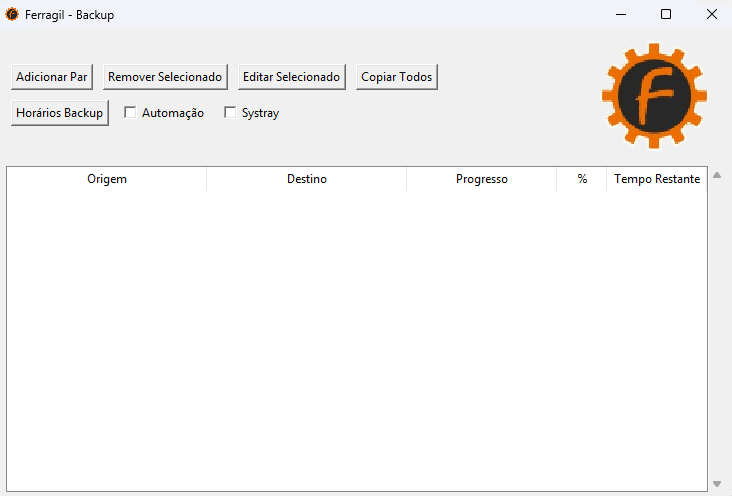

# FerragilBackup-Legacy

This is a python software created to automatically (or manually) backup specified directories with user friendly GUI and with some copy/paste verification. 

# Features
- It will only copy files from origin directory that have been edited or new files.
- The automation (copy/paste) task runs every time the .exe is launched, at Windows startup, and you can create custom schedules.
- systray function to hide from taskbar 
 * automation and systray combined = minimized auto start

# Support
For Windows XP, Vista and 7 before Service Pack updates (Legacy win32)

# Known bugs
- When click to enable "Systray" GUI automatically minimize

